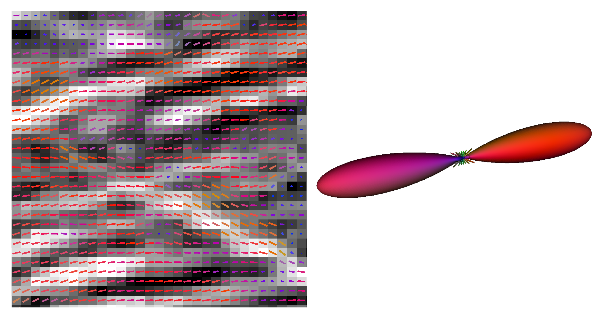

# fiberorient

[](https://codecov.io/gh/scott-trinkle/fiberorient)



fiberorient is a package for performing structure tensor analysis and
calculating orientation distribution functions from 3D imaging data.

Code and methodology stem from work published as: 

Trinkle, S., Foxley, S., Kasthuri, N., La Rivière, P., “[Synchrotron x-ray
micro-CT as a validation dataset for diffusion mri in whole mouse
brain](https://doi.org/https://doi.org/10.1002/mrm.28776),” Magnetic Resonance
in Medicine, vol. 86, no. 2, pp. 1067–1076, 2021.

For more information, see [my blog post](https://www.scotttrinkle.com/news/microct-paper/).

## Installation

fiberorient can be installed with pip:

```
pip install fiberorient
```

For local installation, first clone the repo:

`git clone https://github.com/scott-trinkle/fiberorient.git`

`cd` into the directory:

`cd fiberorient`

and run (preferably in a virtual environment): 

`pip install -e .`

## Usage

The primary utility of fiberorient is estimating the orientation of local 
structures in 3D imaging data using structure tensor analysis:

```
from fiberorient import StructureTensor

img = np.load('img_data')  # some 3D image data
st = StructureTensor(d_sigma=1, n_sigma=3)
st.fit(img)
vectors = st.get_vectors(img)
```

fiberorient is also used to express groups of vectors as orientation 
distribution functions (ODFs) on a basis of real, even spherical harmonic
functions:

```
from fiberorient.odf import ODF
from fiberorient.util import make_sphere

odf = ODF(degree=8)
odf.fit(vectors)

sphere = make_sphere(3000)
odf_on_sphere = odf.to_sphere(sphere)
```

The package also includes a number of utilities in the `vis` module for generating
useful data visualizations, as well as metrics for comparing arrays of vectors
and ODFs in the `metrics` module.

Further examples are available as Jupyter notebooks in `examples/`
